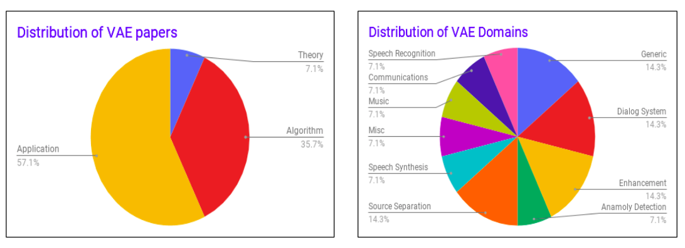

# Paradigms: Variational Inference


There are 25 papers that mention the word 'Variational' in title.


### Variational AutoEncoder

Variational AutoEncoders come under a class of models that can be termed as latent stochastic variable models - they employ latent random variables in their framework. There are numerous references about different components of a Variational AutoEncoder and its interpretations.

#### Why so popular?

Latent Stochastic variable models provide a mechanism to jointly train both the latent representations as well as the downstream inference network In other words, they are expected to both discover and disentangle causal factors of variation present in the distribution of original data, so as to generalize at inference time. This ability to incorporate random variables within their framework and the potential to identify causal factors of variation in input data makes variational models attractive with respect to many applications from feature extraction through data augmentation. These applications cover both generative processes - in terms of the ability of such models to generate novel content - to discriminative processes - in terms of the robustness of such models to noise and other perturbations. There are works that combine these advantages and generate additional data for a discriminative task as well.

### Just give me the math

### Where are the contributions

Contributions at ICASSP can be mainly categorized into two classes: Improving the optimization procedure of VAEs and applications that exploit neat properties of VAEs.

